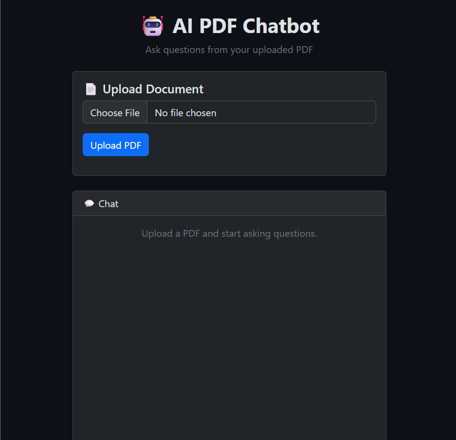
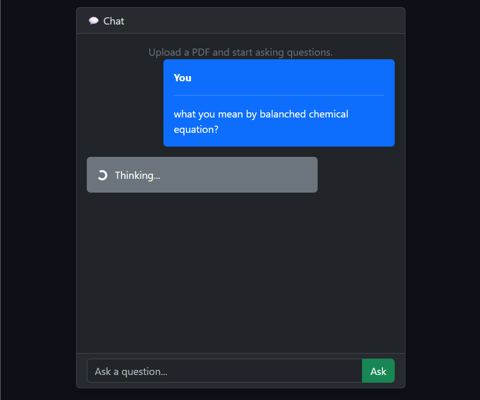
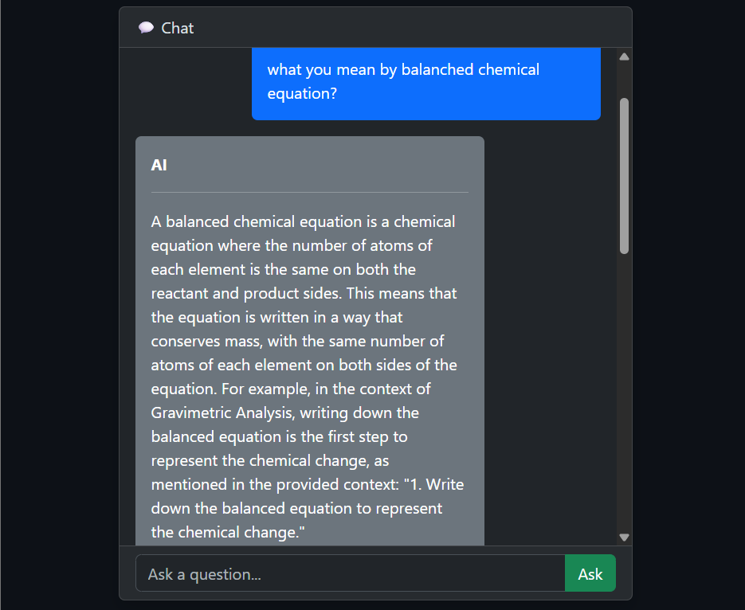

# 🤖 AI PDF Chatbot

An AI-powered PDF Question Answering system built using FastAPI, ChromaDB, HuggingFace Embeddings, and Groq LLM.

Upload a PDF document and ask questions in natural language. The chatbot retrieves relevant information from the document using semantic search and generates context-aware responses through Retrieval-Augmented Generation (RAG).

This project represents my first major step toward building intelligent AI agents and understanding the technologies that power modern AI systems.

---

# 🚀 Features

* 📄 Upload PDF documents
* 📖 Automatic text extraction from PDFs
* ✂️ Intelligent text chunking
* 🧠 HuggingFace Embeddings (`all-MiniLM-L6-v2`)
* 🗄️ Chroma Vector Database
* 🔍 Retrieval-Augmented Generation (RAG)
* 🎯 Adaptive Retrieval Strategy
* 📚 Source Page Citations
* 💬 Chat-style Interface
* 🌙 Dark-Themed UI
* ⚡ FastAPI Backend
* 📊 Real-time PDF Processing Tracker

---

# 🏗️ System Architecture

```text
PDF Upload
    │
    ▼
Text Extraction
    │
    ▼
Text Chunking
    │
    ▼
Embedding Generation
    │
    ▼
Chroma Vector Database
    │
    ▼
Semantic Retrieval
    │
    ▼
Groq LLM
    │
    ▼
Answer + Source Pages
```

---

# 🛠️ Tech Stack

## Backend

* FastAPI
* Python
* LangChain

## AI & Machine Learning

* HuggingFace Embeddings
* Sentence Transformers
* ChromaDB
* Groq LLM
* Retrieval-Augmented Generation (RAG)

## Frontend

* HTML
* Bootstrap 5
* JavaScript

---

# 📂 Project Structure

```text
pdf-chatbot/
│
├── application.py
├── requirements.txt
├── .gitignore
│
├── config/
│   └── settings.py
│
├── services/
│   ├── pdf_loader.py
│   ├── embeddings.py
│   ├── vectordb.py
│   └── rag.py
│
├── static/
│   └── scripts.js
│
├── templates/
│   └── index.html
│
├── uploads/
└── vectorstore/
```

---

# ⚙️ Installation

## 1. Clone Repository

```bash
git clone https://github.com/YOUR_USERNAME/ai-pdf-chatbot.git

cd ai-pdf-chatbot
```

## 2. Create Virtual Environment

```bash
python -m venv venv
```

## 3. Activate Virtual Environment

### Windows

```bash
venv\Scripts\activate
```

### Linux / macOS

```bash
source venv/bin/activate
```

## 4. Install Dependencies

```bash
pip install -r requirements.txt
```

## 5. Create Environment Variables

Create a `.env` file:

```env
API_KEY=YOUR_GROQ_API_KEY
```

## 6. Run the Application

```bash
python application.py
```

Open:

```text
http://localhost:8000
```

---

# 🎯 Key Concepts Demonstrated

This project demonstrates practical experience with:

* Retrieval-Augmented Generation (RAG)
* Vector Databases
* Embedding Models
* Semantic Search
* FastAPI Development
* LLM Integration
* AI Application Architecture
* Frontend–Backend Integration

---

# 📸 Screenshots

## Upload Interface



## Chat Interface



## AI Response with Sources


---

# 🔮 Future Improvements

* Multiple PDF Support
* Chapter-wise Source Citations
* Streaming Responses
* Hybrid Search (BM25 + Vector Search)
* User Authentication
* Docker Deployment
* Cloud Hosting
* Multi-Agent RAG Systems

---

# 👨‍💻 Author

**Sudharsan M S**

Aspiring AI Agent Developer

This project serves as a foundational milestone in my journey toward building intelligent AI agents. Through this project, I explored vector databases, embeddings, semantic search, FastAPI, and Retrieval-Augmented Generation (RAG), which form the building blocks of modern agentic AI systems.

---

# ⭐ Acknowledgements

* FastAPI
* LangChain
* ChromaDB
* HuggingFace
* Groq

If you found this project interesting, consider giving it a ⭐ on GitHub.
